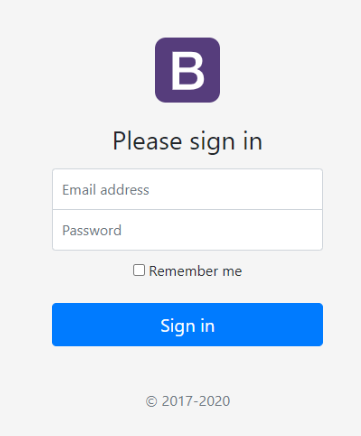
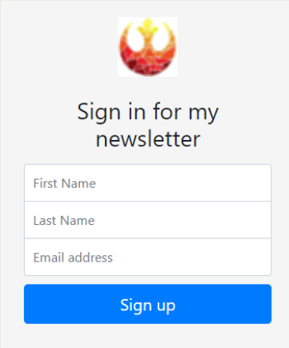

# Mailchimp Project

In this tutorial, we will create a sigunup screen where we will be able to add emails and names of people to a mail distribution list using mailchimp's API. We will leverage the knowledge we have achieved with our previous lessons and use some existing templates from Bootstrap in order to speed up our development.

**Please try to do it based on your own knowledge first, if you get stucked source code is provided where required.**

## Prerequisites
- Command-line tutorial
- Bootstrap knowledge
- Node + Express exercises completed
- **nodemon** extension installed: ```npm install -g nodemon```

## Instructions

### Sign up form setup
- Create a new folder location to create the **signup-news** project
- Create the following files within your project:
    - app.js
    - signup.html
    - success.html
    - failure.html
- Initialize the node project using the ```npm init``` command
- Installl the following packages
    - express
    - request
- Create our app server and just to check it is running send a "Hello World" message to the front end.
> The server should be listening to port 3000

**You can also get a starter code that has some of these steps and some of the following ready for you from the class repository.**

In order to save time we will be using one of the examples provided in the [Bootstrap site](https://getbootstrap.com/). In particular the [Sign-in](https://getbootstrap.com/docs/4.5/examples/sign-in/) example.
    - To get this code, we will do right mouse click on the page and select the "_View source code_" option from the menu.
    - We will copy it all and paste it into our **signup.html** file.

If we open the page right away, we will notice that none of the design, styles or anything was brought over. The reason beign that we have to do some clean up to have it back to a working state.

First, notice the link reference below the ```<!-- Bootstrap core CSS -->``` comment. This is supposed to bring over the bootstrap css. But as we can notice from the href, it is pointing to a local file for the source coude. In our case we would want to use the CDN css version. So we can look at the reference in the [Bootstrap documentation](https://getbootstrap.com/docs/4.5/getting-started/introduction/) and substitute the line.

There are some infile css styles that we can keep or remove.
Below the ```<!-- Custom styles for this template -->``` comment we can see a reference to again a local style sheet that we don't have. Luckily, we can access that style sheet by clicking on the link and copy it into a local file that we will call **style.css**. Once we have that style sheet, we just have to change the reference in thet stylesheet reference.
- Change the title of the page to "Signup newsletter"

**NOTE:** This is already included in the source code if you downloaded.

---
Version 1            |  Version 2
:-:|:-:
  |  
 | 

We will be aiming to move from Version 1 to Version 2, since we are in need of more information for our purposes. For that we will need to:
- Add the First Name and Last Name field
- Move the Email address field to the end
- Remove the Password field
- Remove the "Remember me" checkbox
- Remove the copyright legend
- Update the sign in message
- Change the icon (optional)

Somethings to be aware of:
- Check the type of every field
- Check the styles of every field and make sure that they match our final design (notice the round corners)  _optional_

### Backend setup

Now that at least the aesthetics of our form are ready, it is time to setup our express server. In the root path for our server make sure that you are serving the _signup.html_ page

Once served you will notice that part of the styling we did previously is gone. The reason is that the reference to our files gets messed up once it is inside a server. Thus, we will need to tell the server where to find them. To do so we will:
- Create a new folder inside our project called **public**
- Inside of public place our **css** folder and **images** (if you have)
- Next we will have to tell our express server where to find the static content. To do so, we will add the following line after we create our server: ```app.use(express.static("public"));```
- This line is telling our server where should you start looking for static elements within our server, such as stylesheets, images, files, etc. You can add as many paths as you want to your server.

The next step is to get the server to receive the information from our form in order to build the request to the mailchimp API. Our HTML form is already configured to send a POST request to the back end in the root endpoint, but currently there is not method listening to this request. 

Before we can read the values from the form, notice that in the HTML form we did not set the **name** attribute of the fields.
- Set the field names as **fName**, **lName** and **email** in the corresponding fields in the form.
- Add a **POST** endpoint listener method 
- Using the **body-parser** module, read the values from the fields and write them to the console.

### Mail chimp sign up

Now we are ready to contact our API. In this tutorial we will work with the Mailchimp API. Mailchimp is an all-in-one marketing platform that helps you manage and talk to your clients, customers, and other interested parties. Its approach is to market focusing on healthy contact management practices, beautifully designed campaigns, and powerful data analysis. 
- Go to [mailchimp.com](https://mailchimp.com/)
- If you have an account just Log In
- If you don't have an account, create a new one clicking on the "Sign Up Free" button on the top right
    - Make sure you check your email right away, since you will receive an email to activate your account.
    - Select the free plan and complete your registration information.
- We will need to get an API key in order to start our service. Thus, we need to go to **Account > Account Extras > API keys > Create A Key**
- Copy that key and place it into our **app.js** file in a variable called **apiKey**
- From **Audience > Manage Audience > Settings**, scroll to the bottom and get **Unique Id**
- Copy that value and save it into the **list_id** variable.
- To find the value for the **SERVER_PREFIX** parameter, log into your Mailchimp account and look at the URL in your browser. You’ll see something like https://us19.admin.mailchimp.com/ — the **us19** part is the server prefix. Note that your specific value may be different. 

Once we have our credentials we will need to check what we can do. In order to learn about the options we can visit the [developers' site](https://mailchimp.com/developer/) of Mailchim's API. In there you can learn everything there is to learn about the interaction with their services, and all the options at your hands with clear, well documented Howto guides. For this exercise we will only need to sign up a new user into our delivery mail list. 

For learning what to do, we will go to **API References**. On the left side menu, we will scroll until the **Lists/Audiences** link. We are interested in the **Batch suscribe or unsuscribe** method described there. At the time I am writing this tutorial, the version is 3.0.22. As of this moment, mailchimp have already created a Node module you can import into your project to make your interaction managed by their code. They have sample code on how to configure and use this module.

For the purposes of explaining the way most of the APIs work, I will be using an older approach to call the API where we configure every single step of the way. But feel free to try it as well with the existing code at the time you are reading this.

### API connectivity
Our first task will be to build the url to contact

**Create request url**

- The endpoint is **https://{SERVER_PREFIX }.api.mailchimp.com/3.0/**
    - Substitute **SERVER_PREFIX** with the value you got from our previous step
- The path for our process, as per the documentation is **/lists/{list_id}**
    - Substitute the **list_id** with the value we saved previously.
- Concatenate all the values and save them in the **url** variable.

This method will require us to perform a **POST** request. In order to do so, we wil not use the https.get method, but instead we will use the https.request method. As discussed in the presentation, or by the documentation, we will need to provide an extra parameter called options that will contain the specification that we will use the **POST** method instead of the **GET** and the authentication information. 

Build the options object 
- Add field **method** with the value **POST**
- Add field **auth** with value **{user_name}:{apiKey}**

The final step is to build the body parameters that will need to be sent to the backend. This is documented in the API. In our case the only element that is required is members, that is an **array** of objects, each representing an email address and the subscription status for a specific list. 

Every object inside the array needs an **email** and a **status** that could be "_subscribed_", "_unsubscribed_", "_cleaned_", or "_pending_". Nevertheless, that is not the only data we want to save about our subscriber. In our case we want to save the user's name and last name. In this case Mailchimp's API allows saving personalized data inside the **merge_fields**. This is a common strategy amongst APIs, so when you are not finding a way to save your information, check on these flexible fields.

Mailchimp's API will allow as many merge fields as you need, but you first have to configure them in your account. To do so, in your mailchimp's dashboard, you will need to go to **Audience > Manage Audience > Settings > Audience fields and \*|MERGE|\* tags**

You will see there are already some prefilled fields, such as first name and last name, JUST THE ONES WE NEED! But if at any point you needed to add more information, you can add it here. The fourth column with the title "Put this tag in your content" will contain the name of the tag we will need to set, these fields are named MERGEX where X is a number; we could use that label, or we can also create our own labels in the field provided. In this case, the fields already has a field name **FNAME** and **LNAME**

Now that we know this, let's create the data element with all the information we need.

**Create request data element**

- Create a Javascript object called **data**
- Inside of data add an array called **members**
- Inside of the _members_ array create an anonymous object
- Inside the anonymous object add the fields **email_address**, **status** and **merge_fields**
    - **email_address** should have the email value we got from the form
    - status should be "_subscribed_"
    - merge_fields should be an object with fields **FNAME** and **LNAME**
        - The value of **FNAME** is the name we got from the form
        - The value of **LNAME** is the last name we got from the form

By now we have all the elements required for doing the call. But we will do it in a different way than what we had used in the https.get method. In this case we need to write something into the body, rather than just sending everything in the url. Thus, we will create to receive the returned object after executing the https.request method and then we will write into it. Once we have written, we can then end the process to signal it to get going.

**Do the call to the backend**

- Create a variable called **mailRequest** and assign to it the value return by the call of the **http.request** method
    - Call the _https.request_ with the **url** and **options** values we already built and make sure you at least consoloe log the response on the _callback_ function and return a success message to our awaiting client.
- Once you have the _mailRequest_ object, we will use its **write** method to send the data object
- Finally, we will signal the end of the request by calling the **end** method on the _mailRequest_ object.

Notice that when we log the response, we use the **JSON.parse** method, so we can see the content. If we don't use it, then we will just see a much of encoded information.

At this point, if we run our server and put some information in the form in the proper format we can see that the information gets properly saved in our **Audience** list in mailchimp. You can check that out in the mailchimp's dashboard.

Now that the call is taken care of, we have to take care of the quality of our response. In our best case scenario, we would want to signal the user that everything went well, or let them know that there was some error in the process. Luckily, most API requests gives you information on how the process concluded, either with an error, or with a message embedded in the response. To know exactly how every api response, please refer to the documentation.

---

For our tutorial, we will rely in two elements to decide if this was either a failure or a success. But before we get to that let's create the webpage that will be returned in either case.

**Create a success page with the jumbotron**

Use a message such as "_Awesome_", "_Success_", "_Yeah!_" or something similar for the main header, and a simple sentence conveying the fact that now the users will be receiveing some information from now on.

**Create a failure page with jumbotron**

Use a message such as "_Ups!_", "_Sorry_", "_Fail!_" or something similar for the main header, and a simple sentence conveying the fact that there was a problem processing their request.

**(You can find information on how to use a jumbotron from the Bootstrap example's page)**

### Backend management

Now that these pages are ready lets's create the logic for reaching them in the proper case.

- Our first checkpoint is the **response.statusCode**, as per previous lessons, we know that any http request returns with a particular code depending on the success or nature of the failure to complete the request. So the code we are looking for is 200. Failure to get this code, should redirect them to the **failure.html** page.

- The second checkpoint comes from the API result itself. If we review the structure of the response, we will notice several things:
```js
{
  new_members: [],
  updated_members: [],
  errors: [
    {
      email_address: '...@cemail.com',
      error: '...@cemail.com is already a list member, do you want to update? please provide update_existing:true in the request body',
      error_code: 'ERROR_CONTACT_EXISTS'
    }
  ],
  total_created: 0,
  total_updated: 0,
  error_count: 1,
  _links: [ {...} , { ... } ]
}
```
There are 7 high level labels: *new_members*, *updated_members*, *errors*, *total_created*, *total_updated*, *error_count* and *_links*. For our use case we will focus on the *new_members*, *error_count* and *errors* tags. 
- **new_members**: Will contain the new register object when the user has been successfully added. Let's remember that this particular API call is able to handle batch suscribes, thus it is prepared to receive multiple records at once. But in our case we are just creating a single user at the time. IF for some reason there was an error on the creation process, this array will be empty. (as in the example above)
- **error_count**: Will have a counter on how many entries form the submitted list had an error. Again, given that we are just subscribing one user at the time, the value we would expect is either 0 or 1.
- **errors**: If the value of _error_count_ is different of 0 then we know we have a problem, this array will contain the elements explaining the root of the error. It will contain the *email_address*, an error message and an *error_code*.

We will check against the *error_count* to see if there is any error.

But there is still one more thing we have to be aware of. There could be the case that the object we are expecting is not available, either because it was not send or because we are calling a different API (100% possible). Javascript under Node.js became a very event-oriented language, so there is a way of checking if the expected variable is contained in the response or not. That is the **on** method. To use it, we take the **response** object and call the **on** method with the first parameter being the **name of the variable** we expect, and the second parameter is the **callback function to execute** if the object is there.

- Check the status code of the response to be 200
    - If it is not, return the *failure.html* page
    - If it is 200, verify if the **data** object is part of the **response**, you should also check for the **error** element. 
        - In the case of the existance of the error element, return the _failure.html_ file
        - If **data** is in the _response_, parse the response to a *JSON* object and check the *error_count* field
            - If the _value_ is greater than 0, return _failure.html_. Console log the **error** and the **error_code** elements of the error.
            - Else return _success.html_

---

At this point we have a proper full cycle system that will signup a new user into our mailing list, and will let us know if it went through or if there were any errors. But there is one more thing to think about in terms of usability. If you go through the User experience, you will notice that if you fail, or even succeed, there is no way of going back, something that is a big failure in user experience, so we should allow the user to go back to the registration page. There is a redirect method in the response object that we can call, this method only needs the path we want to redirect to.
- Add a button to both pages (_success.html_ and _failure.html_) to send you back to the first page.
> Remember that in order to submit a request to the backend you have to do it from an HTML form.

---

We have completed a full front to back development of a system that will send information from the front end form, to our system to a thir-party API. If you would want a look at the completed project, you can take a look at the source code provided

---
[Sample solution](https://gist.github.com/gcastillo56/1a82828cadf93ca529aacbf182a09b96)